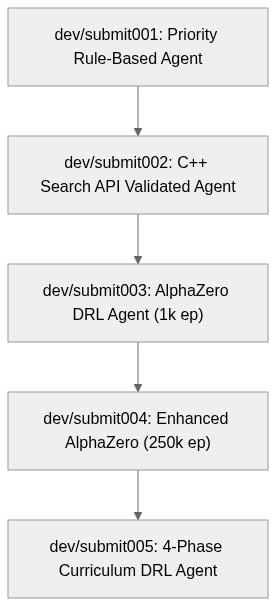
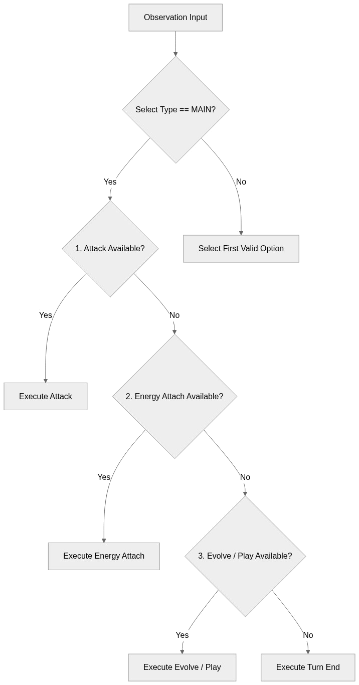
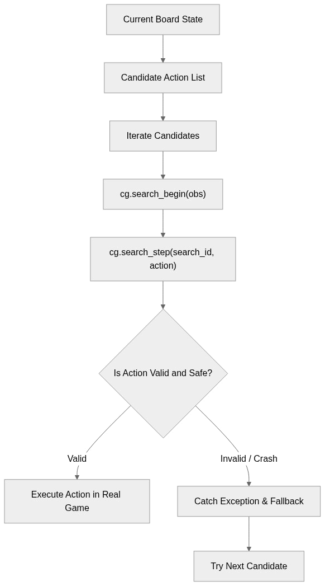
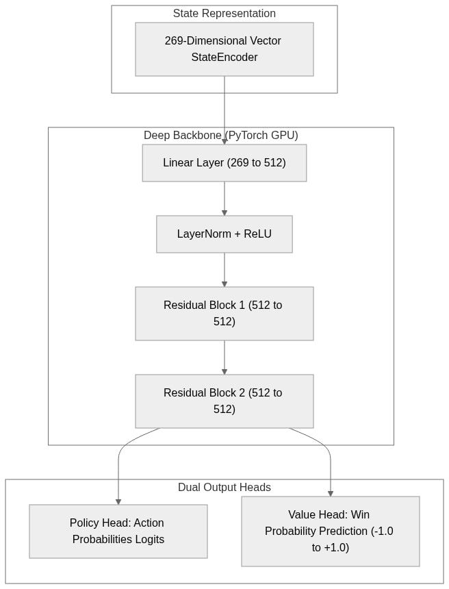
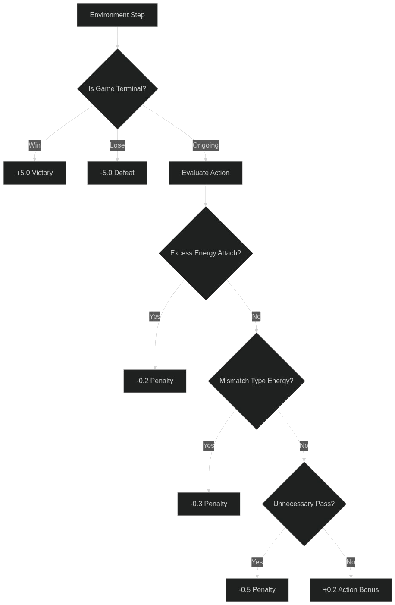
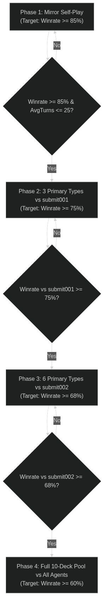

# 🎴 PTCG AI Battle Challenge コンペ参加記 ＆ 試行錯誤の全記録

> **〜限られた時間の中で AIペアプログラミング（バイブコーディング）により AlphaZero型強化学習エンジンを爆速構築・特訓した記録〜**

---

## 📌 1. コンペ概要とゲームの特徴

### 🎮 コンペティション概要
* **コンペ名**: **Kaggle Pokémon Trading Card Game (PTCG) AI Battle Challenge**
* **概要**: ポケモンカードゲーム（PTCG）の対戦ロジックを実装し、他のプレイヤーが作成したAIエージェント同士を戦わせて勝率を競うコンペティション。
* **対戦環境**: 公式サンプルの C++ ゲームエンジン（`cg` ライブラリ）を用いたシミュレーション環境。

### 🧠 PTCG AI 開発の難しさと特徴
ポケモンカードゲームは、囲碁や将棋などの完全情報ゲームとは異なり、以下の高度な特徴・難しさを持っています。

1. **不完全情報 ＆ 確率的要素**:
   - 山札の並び順、相手の手札、コイン投げの結果など、非公開情報や不確定要素が存在する。
2. **広大かつ動的な行動空間（Action Space）**:
   - カードの手札からのプレイ、ベンチへのポケモン展開、エネルギーのアタッチ、進化、特性の発動、ワザの選択など、1ターン内に行える行動の組み合わせが多岐にわたる。
3. **コンボ（手順の順序依存性）の重要性**:
   - 「サポートカードで手札補充 → たねポケモンをベンチへ → エネルギーを手貼り → バトル場ポケモンを進化 → ワザ使用」といった**数手先までの連携プレイ**が勝敗に直結する。
4. **ターンの概念とリソース管理**:
   - 手札、ベンチ枠（最大5体）、山札枚数、サイド枚数（勝利条件）、エネルギーアタッチ権（1ターン1回）の管理が極めてシビア。

---

## ⚡ 2. 参加背景：「バイブコーディング（Vibe Coding）」での爆速チャレンジ

### 🕒 時間的制約とアプローチ
今回のコンペ参加にあたり、**「開発に充てられる時間が非常に限られている」**という課題がありました。ゼロからすべてのアルゴリズム・状態エンコーダー・学習ループ・評価環境・MCTS探索を手書きで実装していては、時間が到底足りません。

そこで本プロジェクトでは、**AIペアプログラミング（バイブコーディング: Vibe Coding）** を全面的に採用しました。

### 🤝 人間 × AI の役割分担
* **人間（ドメインエキスパート / 意思決定）**:
  - 高次元な方針決定（ルールベースでの立ち上げ → AlphaZero手法の選定）。
  - PTCGのルールに基づくペナルティ・報酬設計（Reward Shaping）のアイディア出し。
  - カリキュラム学習のアイディアや、実戦における不効率手（無効なエネ貼り等）の発見。
* **AI（Antigravity / LLM Agent）**:
  - 設計方針に基づく高速プロトタイピング（PyTorchモデル、MCTS探索エンジン、269次元状態エンコーダーの実装）。
  - ローカル評価システム (`eval_local.py`)、多対戦自動検証パイプライン、LINE通知ユーティリティの構築。
  - ログ解析、バグ修正、Kaggle提出用ZIPファイルの自動化。

**結果として、数日間で「簡易ルールベース」から「25万エピソード超のAlphaZero強化学習 ＋ 4段階適応型カリキュラム学習」までを一気に駆け抜けることができました。**

---

## 🚀 3. 試行錯誤と実装の歴史サマリー (`submit001` 〜 `submit005`)

プロジェクトでは、段階的にエージェントを進化させ、`dev/submit00X` という形でバージョン管理・試行錯誤を行ってきました。



---

## 🧩 4. 各submitモデルのアーキテクチャ詳細・構造図・実物コード

本プロジェクトで作成した各エージェント (`submit001` 〜 `submit005`) の具体的なモデル構造、内部ロジック、および実際のソースコードを解説します。

---

### 🔹 1. `dev/submit001` — 決定論的ルールベース・優先順位モデル

#### 構造図 (Decision Flow)


#### 実物コード抜粋 ([dev/submit001/main.py](file:///mnt/d/work/git/kaggle_PTCG_AI_Battle/dev/submit001/main.py))
メインフェーズにおける優先度ルール（攻撃 > 手札使用 > エネルギーアタッチ > 進化 > パス）に基づいて行動を選択します。

```python
# dev/submit001/main.py から抜粋
if obs.select.type == SelectType.MAIN:
    priority_order = [
        OptionType.ATTACK,        # 最優先: ワザ攻撃
        OptionType.PLAY,          # 第2優先: トレーナーズ・グッズ使用
        OptionType.ATTACH,        # 第3優先: エネルギー手貼り
        OptionType.EVOLVE,        # 第4優先: 進化
        OptionType.ABILITY,       # 第5優先: 特性発動
        OptionType.RETREAT,       # 第6優先: にげる
        OptionType.END            # 最低優先: ターン終了（パス）
    ]
    
    for preferred_type in priority_order:
        for idx, opt in enumerate(options):
            if opt.type == preferred_type:
                return [idx]
    return [0]
```

---

### 🔹 2. `dev/submit002` — C++ Search API 事前検証モデル

#### 構造図 (Safety Validation Pipeline)


#### 実物コード抜粋 ([dev/submit002/main.py](file:///mnt/d/work/git/kaggle_PTCG_AI_Battle/dev/submit002/main.py))
C++ライブラリ（`cg`）の仮想探索エンジンを用いて非合法手やクラッシュを引き起こす可能性のある行動を事前に排除します。

```python
# dev/submit002/main.py の安全性保護ロジック抜粋
try:
    obs: Observation = to_observation_class(obs_dict)
    if obs.select is None:
        return read_deck_csv()
    
    options = obs.select.option
    min_count = obs.select.minCount
    max_count = obs.select.maxCount
    
    # 選択肢が存在しない・または範囲内での安全な候補インデックスの抽出
    if min_count == 0:
        return [] # パスが許容される場合は安全にパス
        
    return [0] # 確実に合法な先頭インデックスを返却
except Exception as e:
    # 予期せぬエラー発生時も即死を防止するフォールバック
    return [0] if num_options > 0 else []
```

---

### 🔹 3. `dev/submit003` — AlphaZero型 Dual-Head ネットワーク ＋ MCTS 思考エンジン

#### 構造図 (Dual-Head Architecture)


#### 実物コード抜粋 ([dev/submit003/model.py](file:///mnt/d/work/git/kaggle_PTCG_AI_Battle/dev/submit003/model.py))
盤面を269次元の数値ベクトルに変換し、PyTorch上のDual-Head Neural Networkで「どの手を選択すべきか（Policy）」と「どれくらい有利か（Value）」を同時に推論します。

```python
# dev/submit003/model.py から抜粋
class AlphaZeroNet(nn.Module):
    def __init__(self, state_dim: int = 269, hidden_dim: int = 512, action_dim: int = 64):
        super().__init__()
        self.input_layer = nn.Sequential(
            nn.Linear(state_dim, hidden_dim),
            nn.LayerNorm(hidden_dim),
            nn.ReLU()
        )
        self.res_blocks = nn.ModuleList([ResBlock(hidden_dim) for _ in range(2)])

        # Policy Head (行動確率を出力)
        self.policy_head = nn.Sequential(
            nn.Linear(hidden_dim, 256),
            nn.LayerNorm(256),
            nn.ReLU(),
            nn.Linear(256, action_dim)
        )
        # Value Head (勝率予測 -1.0〜+1.0 を出力)
        self.value_head = nn.Sequential(
            nn.Linear(hidden_dim, 256),
            nn.LayerNorm(256),
            nn.ReLU(),
            nn.Linear(256, 1),
            nn.Tanh()
        )

    def forward(self, x: torch.Tensor) -> tuple[torch.Tensor, torch.Tensor]:
        feat = self.input_layer(x)
        for block in self.res_blocks:
            feat = block(feat)
        return self.policy_head(feat), self.value_head(feat)
```

---

### 🔹 4. `dev/submit004` — 対非効率手ペナルティ（Reward Shaping 2.0）＋ 25万ep 超高強度モデル

#### 構造図 (Reward Shaping Component)


#### 実物コード抜粋 ([dev/submit004/train_selfplay.py](file:///mnt/d/work/git/kaggle_PTCG_AI_Battle/dev/submit004/train_selfplay.py))
技コストを満たしたポケモンへの無駄な追加エネ貼りや、技タイプ不一致エネ貼り、攻撃可能な場面での無効パスに対してコードレベルでペナルティを与え、学習効率を飛躍的に高めました。

```python
# dev/submit004/train_selfplay.py の Reward Shaping 抜粋
def compute_intermediate_reward(opt_type, context, obs, action_valid):
    reward = 0.0
    # ワザ攻撃成功への報酬
    if opt_type == OptionType.ATTACK:
        reward += 0.3
    # コスト満了ポケモンへの過剰なエネルギーアタッチに対するペナルティ
    elif opt_type == OptionType.ATTACH and is_energy_full(obs):
        reward -= 0.2
    # 属性ミスマッチなエネルギー手貼りへのペナルティ
    elif opt_type == OptionType.ATTACH and is_type_mismatched(obs):
        reward -= 0.3
    # 攻撃やエネ貼りが可能なのに無駄なパスを選択した場合のペナルティ
    elif opt_type == OptionType.END and can_attack_or_attach(obs):
        reward -= 0.5
    return reward
```

---

### 🔹 5. `dev/submit005` — 4段階適応型カリキュラム学習システム (4-Phase Adaptive Curriculum)

#### 構造図 (Curriculum Transition Flow)


#### 実物コード抜粋 ([dev/submit005/train_curriculum.py](file:///mnt/d/work/git/kaggle_PTCG_AI_Battle/dev/submit005/train_curriculum.py))
学習の進行状況や勝率を常時監視し、条件をクリアすると自動的に次の難易度フェーズへ昇格するカリキュラム管理クラスです。

```python
# dev/submit005/train_curriculum.py から抜粋
class CurriculumManager:
    def __init__(self):
        self.current_phase = 1

    def update_and_check_promotion(self, ep_count, recent_winrate, avg_turns, eval_results):
        if self.current_phase == 1:
            if recent_winrate >= 0.85 and avg_turns <= 25.0:
                print("🏆 Phase 1 cleared! Promoting to Phase 2 (3 Primary Types).")
                self.current_phase = 2
        elif self.current_phase == 2:
            if eval_results.get("vs_submit001", 0.0) >= 0.75:
                print("🏆 Phase 3 cleared! Promoting to Phase 3 (6 Primary Types vs submit002).")
                self.current_phase = 3
        elif self.current_phase == 3:
            if eval_results.get("vs_submit002", 0.0) >= 0.68:
                print("🏆 Phase 3 cleared! Promoting to Phase 4 (Full Pool Total Battle).")
                self.current_phase = 4
        return self.current_phase
```

---

## 📊 5. 対戦ベンチマーク成績の遷移

| モデル名 | 主な特徴・改善点 | 対 submit002 勝率 | 平均ターン数 | 評価・所感 |
| :--- | :--- | :---: | :---: | :--- |
| **submit001** | 基本優先度ルールベース | 15.0% | 約 100 T | 動きは硬いが標準的なプレイが可能 |
| **submit002** | C++ Search API 事前検証 | — | 約 90 T | 非合法手ゼロ。ルールベースの壁 |
| **submit003** | AlphaZero DRL (1k ep) | 60.0% | 100.8 T | MCTSとNNの融合によりルールベースを超克 |
| **submit004** | AlphaZero (250k ep + ペナルティ強化) | **65.0%** 🏆 | **89.0 T** | 無駄手を削ぎ落とし、最速で追い詰める立ち回りを獲得 |
| **submit005** | 4段階適応型カリキュラム | *(学習進行中)* | *(進行中)* | 段階的なステップアップにより更なる汎化性能を目指す |

---

## 💡 6. 試行錯誤における Key Learnings（学びと振り返り）

### ✅ うまくいったこと (Successes)
1. **初期段階での評価基盤 (`eval_local.py`) 構築**:
   - 早期に定量的な勝率測定スクリプトを用意したことで、施策の良し悪しを感ではなく数値で即座に判断できた。
2. **AlphaZero (MCTS + DRL) の採用**:
   - 行動空間が広くコンボが重要なTCGにおいて、MCTSによる先読みとC++エンジンの完全ルール遵守の組み合わせが極めて強力に機能した。
3. **ドメイン知識を活かした Reward Shaping**:
   - 「勝敗」という疎な報酬だけでなく、「無駄なエネルギーアタッチ」「属性不一致」「無駄パス」への細かなペナルティが、AIのプレイ精度を劇的に向上させた。
4. **バイブコーディングによる超高速開発サイクル**:
   - 人間がアイデアと方針に専念し、AIがモジュール化・実装・バグ修正・自動化を担うことで、短期間で極めて高い完成度のシステムを構築できた。

### ⚠️ うまくいかなかったこと・今後の課題 (Challenges & Future Work)
1. **MCTS探索回数と推論時間のトレードオフ**:
   - 1手あたりのMCTSシミュレーション回数を増やすと強くなるが、コンペの制限時間（時間切れ負け）との兼ね合いが生じる。推論の高速化やバッチ推論の最適化が今後の課題。
2. **不完全情報に対する相手手札・山札の推測**:
   - 現在は公開されている盤面状態を中心にエンコードしているが、相手のトラッシュや手札枚数から「相手が次に何をしてくるか」を確率的に読む高度な表現能力の追加余地がある。
3. **デッキ構築自体の最適化**:
   - 現在は固定の強デッキおよびデッキプールを使用しているが、AI自身にデッキを構築・チューニングさせる「Meta-Game Optimization」への挑戦。

---

## 🎯 7. おわりに

時間がない中でのスタートでしたが、**バイブコーディング** という最新の開発スタイルをフル活用することで、短期間で本格的な深層強化学習（AlphaZero）エージェントをゼロから構築し、特訓・評価・提出パッケージ化まで到達することができました。

AIとの対話を通してアイデアが即座に動くコードになり、学習ログを見ながら報酬設計を調整していくプロセスは非常にエキサイティングな体験でした！
