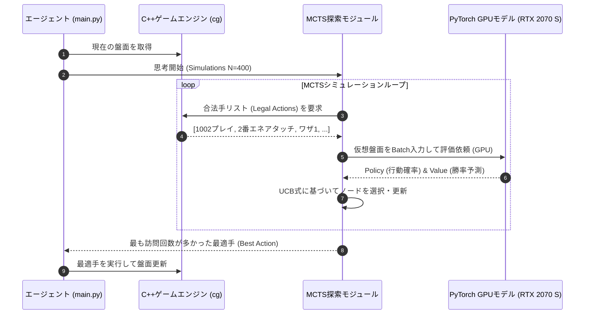
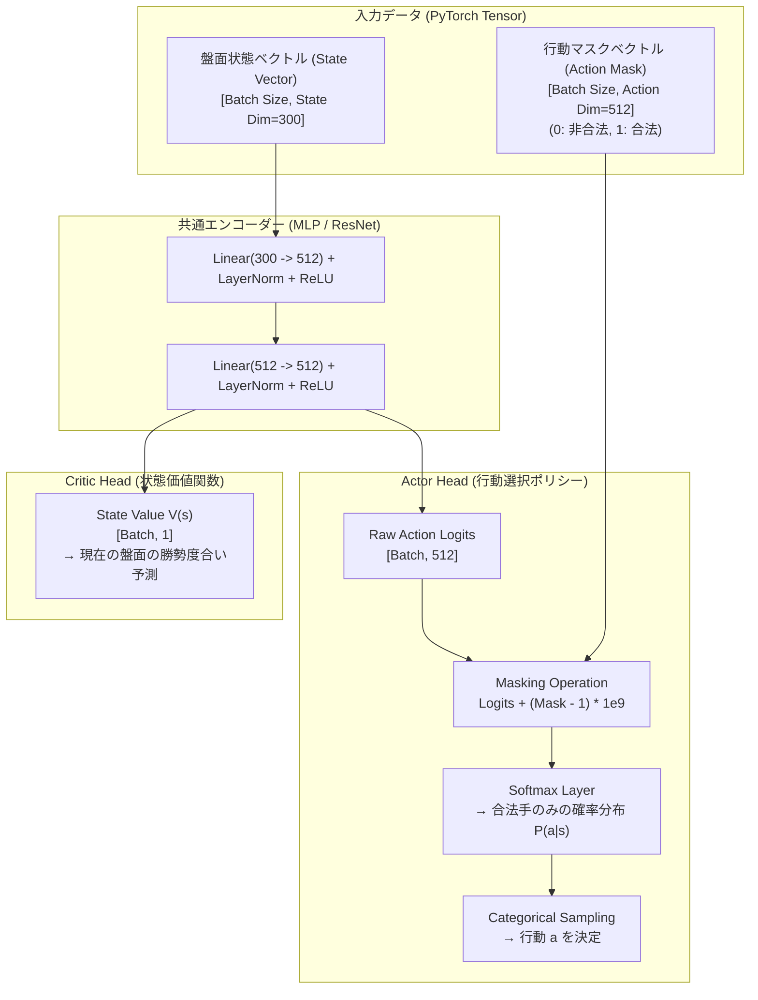
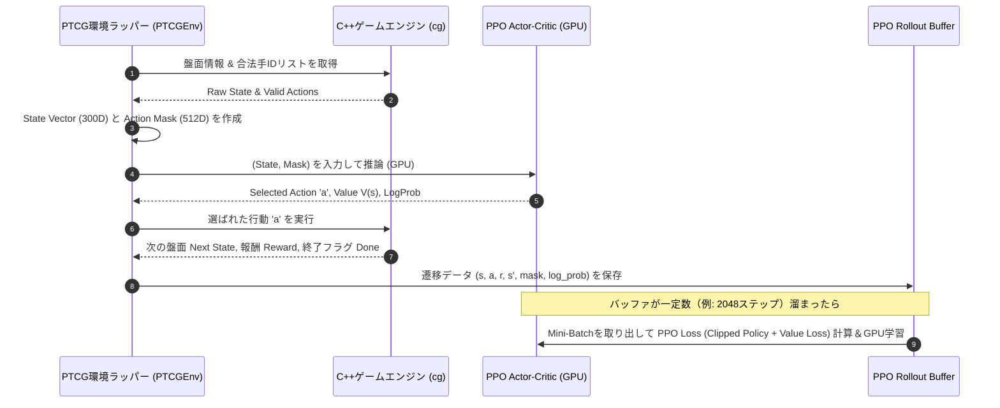

# PTCG AI Battle: 深層強化学習アルゴリズム詳細比較 & アーキテクチャ設計書

本ドキュメントでは、ポケモンカードゲーム（PTCG）AI思考エンジンの開発における2つの主要な深層強化学習（DRL）アプローチ**「AlphaZero方式（MCTS + NN）」**と**「Masked PPO / Masked DQN方式（Direct Policy Net）」**の比較、および両方式のモデル内部構造・シミュレーションフローを詳細に解説します。

---

## 1. アルゴリズム比較サマリー（メリット・デメリット）

| 比較項目 | A. AlphaZero方式 (MCTS + Value/Policy Net) ★採用方針 | B. Masked PPO / Masked DQN方式 (Action-Masked RL) |
| :--- | :--- | :--- |
| **概要** | C++エンジンの探索（MCTS）とNNの評価値を融合し、数手先まで読み切る。 | 盤面状態を入力し、**行動マスク（Action Masking）**を用いて1回のNN推論で直接行動決定する。 |
| **合法手（ルール遵守）** | **100%遵守**（C++探索木が合法手のみを展開） | **100%遵守**（マスク処理により非合法手の確率を0にする） |
| **長所（メリット）** | ・**圧倒的な読みの深さ**：コンボ（手札使用→エネ貼り→進化→攻撃）を先読み可能。<br>・**サンプル効率が高い**：探索により少ない対戦数でも正確な判断を学習。<br>・**相手の返しターンを予測**できるため、防御的な立ち回りが強い。 | ・**推論速度が爆速**（MCTSの探索展開が不要でミリ秒以下で応答）。<br>・標準的なGym/Gymnasium環境（`env.step(action)`）に落とし込みやすく、既存のCleanRL/Stable-Baselines3等を活用可能。 |
| **短所（デメリット）** | ・1手ごとの思考時間が長い（MCTSシミュレーション回数に比例）。<br>・探索木の構築用にC++エンジンAPIの呼び出しコストがかかる。 | ・数手先のコンボ（複雑なカード手順）をNNが「直感」で当てる必要があり、**学習収束に膨大な対戦数が必要**。<br>・カードゲームの巨大かつ動的な行動空間の固定次元定義が複雑。 |
| **PTCGへの適合性** | **極めて高い**（TCGのような不完全情報・選択肢可変ゲームの王道） | 中程度（選択肢が単調なゲームや、高速推論が至上命題な用途向け） |

---

## 2. 方式A：AlphaZero 方式の詳細（本プロジェクト採用方針）

### ① ネットワーク構造 (Dual-Head Architecture)

```mermaid
graph TD
    subgraph Input ["1. 盤面状態入力 (State Representation)"]
        S1["バトル場情報<br>(HP, エネ, 状態)"]
        S2["ベンチ情報<br>(5枠 × 2人分)"]
        S3["手札・トラッシュ<br>(Card ID Embedding)"]
        S4["ゲーム進行<br>(サイド数, ターン数)"]
    end

    subgraph Preprocess ["2. 特徴量エンコーダー"]
        Concat["Vector Concatenation<br>(約 256〜512次元)"]
    end

    subgraph Backbone ["3. ディープバックボーン (PyTorch / GPU)"]
        FC1["Linear Layer + LayerNorm + ReLU (512)"]
        FC2["Residual Block 1 (512 -> 512)"]
        FC3["Residual Block 2 (512 -> 512)"]
    subgraph DualHead ["4. デュアルヘッド出力"]
        PolicyHead["Policy Head (方針出力)<br>Linear(512 -> Action Size)<br>→ 各行動の選択確率 (Softmax)"]
        ValueHead["Value Head (盤面評価値)<br>Linear(512 -> 1)<br>→ 盤面の勝率予測 [-1.0 ~ +1.0] (Tanh)"]
    end

    S1 & S2 & S3 & S4 --> Concat
    Concat --> FC1 --> FC2 --> FC3
    FC3 --> PolicyHead
    FC3 --> ValueHead
```

### 各出力の役割と学習損失関数 (Combined AlphaZero Loss)
1. **Policy Head（方針出力 $\mathbf{p}$）**: 今の盤面において「どの手（カードプレイ、エネ貼り、ワザ使用等）が有効か」のPrior確率を出力し、MCTSの探索効率を最適制御します。
2. **Value Head（価値出力 $v$）**: 探索木の末端（ターン終了時など）の盤面が「どれくらい勝利に近いか（-1.0〜+1.0）」を即座に予測します。

学習時は、勝敗結果 $z$ とMCTSで得られた探索分布 $\boldsymbol{\pi}$ の両方を用いて、以下の合成損失関数をGPU上で最適化します：

$$\mathcal{L}_{\text{total}} = \underbrace{(v - z)^2}_{\text{Value Loss (MSE)}} - \underbrace{\sum_{a} \pi_a \log(p_a)}_{\text{Policy Loss (Cross Entropy)}}$$

---

## 2.5 報酬関数・ペナルティ設計一覧 (Reward Shaping & Penalties Table)

強化学習モデルが「単色高火力exデッキ」の強みを最大限引き出し、不必要なパスや自滅を防止するために設計・適用されている報酬（Reward）および罰則（Penalty）の一覧です：

### 📊 報酬・罰則パラメータ一覧

| 区分 | 対象アクション / 状態変化 | 報酬・罰則値 | 目的・設計意図 |
| :--- | :--- | :---: | :--- |
| 🟢 **終局** | **対戦勝利 (Match Victory)** | **`+5.0`** | **最優先目的**。勝率向上を強力に誘導するヘビー報酬設定。 |
| 🔴 **終局** | **対戦敗北 (Match Defeat)** | **`-5.0`** | 敗北回避の強いペナルティ。 |
| 🟢 **盤面** | **相手ポケモン気絶 (Prize Card Taken)** | **`+1.5` / 枚** | サイドを取る積極的な撃破・アドバンテージ獲得への報酬。 |
| 🔴 **盤面** | **自ポケモン気絶 (Prize Card Lost)** | **`-1.5` / 枚** | 不要な気絶（サイド取られ）の回避。 |
| 🟢 **戦術** | **ワザ使用・攻撃成功 (OptionType 8 / ATTACK)** | **`+0.3`** | ダメージを与える・気絶を狙う積極的攻勢への加点。 |
| 🟢 **戦術** | **エネルギー手貼り / たね出撃 / 進化** | **`+0.2`** | アタック準備・ベンチ展開（0体負け防止）への基本報酬。 |
| 🟢 **戦術** | **トレーナーズ効果プレイ (OptionType 2 / PLAY)** | **`+0.2`** | 手札のリソース有効活用。 |
| 🔴 **反則手** | **無駄なパス (Unnecessary Turn End)** | **`-0.5`** | **手札・エネルギー・ワザ使用が可能にも拘わらずPASS**した場合のペナルティ。 |

---

### ② 1ターンの思考フロー (MCTS + NN 融合)



---

## 3. 方式B：Masked PPO / Masked DQN 方式の詳細

### ① アクションマスキング（Action Masking）の仕組み
カードゲームでは全行動の組み合わせ（例：手札のカード選択、対象のポケモン選択など）を固定の次元数（例：`Action Space Size = 512`）としてあらかじめ定義します。
しかし、毎ターン使える手は限られるため、非合法手のアクションLogit（出力値）に巨大な負の数（$-\infty$ または $-10^9$）をかけることで、Softmaxの出力確率を強制的に `0` にします。

$$\text{Masked Logits}_i = \begin{cases} \text{Logit}_i & \text{if Action } i \text{ is Legal (Mask}_i = 1) \\ -10^9 & \text{if Action } i \text{ is Illegal (Mask}_i = 0) \end{cases}$$

$$\text{Action Probabilities} = \text{Softmax}(\text{Masked Logits})$$

### ② Masked PPO (Actor-Critic) のネットワーク構造



---

### ③ Masked PPO / DQN のステップ実行＆学習フロー



---

## 4. 両方式の比較・使い分けの結論

| 観点 | AlphaZero方式 (MCTS+NN) ★採用方針 | Masked PPO / DQN方式 |
| :--- | :--- | :--- |
| **なぜMCTSが優位か** | PTCGは1ターン内に「手札使用→エネルギー添付→特性起動→ワザ使用」と**複数アクションの連続（連鎖）**が発生します。Masked PPOの場合、途中の選択を間違えると最終的な攻撃にたどり着けないため、探査効率が極めて悪くなります。MCTSなら「最終的な攻撃でサイドを取れる選択肢の鎖」を木探索で事前に見つけ出せます。 | 1ターンの行動が1手で終わるゲーム（格闘ゲーム、囲碁・将棋の標準ルール）や、レスポンス速度を最重視する場合に向いています。 |
| **Kaggle対戦時** | MCTSシミュレーション数を調整（例: 200〜400回）することで、制限時間内で最高の思考力を発揮可能。 | 推論速度がミリ秒以下と高速。ただし直感依存のため、複雑な詰み盤面を見落とすリスクあり。 |
