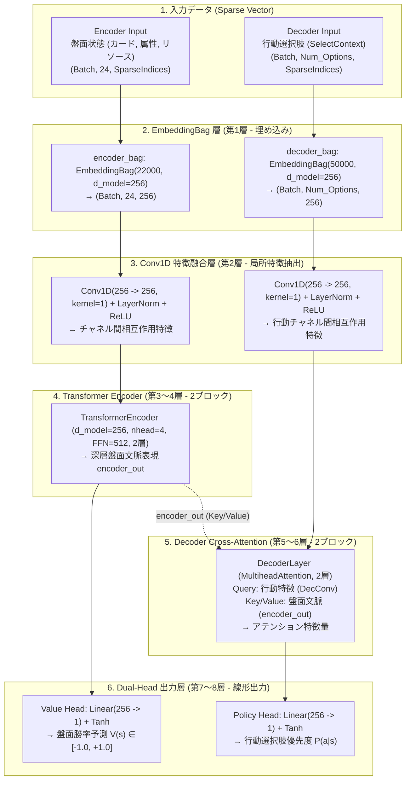
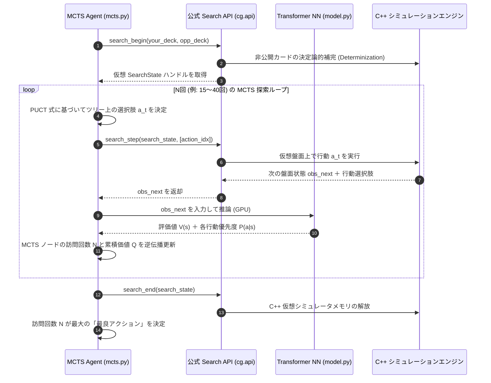

# dev/submit006 (Conv1D ✕ Transformer Hybrid 8層 DRL エージェント) 実装構造＆仕様ドキュメント

本ドキュメントでは、Kaggle 公式サンプルノートブック (`samples/Reinforcement_Learning_and_MCTS_sample_code/`) の洗練された構造を取り入れ構築した **`dev/submit006`** の設計思想・ニューラルネットワーク層構造・公式 Search API 連携仕様・使い方について詳細に解説します。

---

## 📌 アーキテクチャの概要と先進性

`dev/submit006` は、従来の固定長 MLP（ResBlock）アーキテクチャから脱却し、ポケモンカードゲーム（PTCG）のゲーム的特徴（カード組み合わせの多様性・動的選択肢・非完全情報）に完全に適合した **「Conv1D ✕ Transformer Hybrid 8層構造」** を採用しています。

### 🌟 3つの革新的機能
1. **EmbeddingBag ✕ SparseVector による動的カード埋め込み**:
   - 全 22,000 語彙（Encoder）および 50,000 語彙（Decoder）の埋め込み空間を構築。
   - 数千種類のカードIDやワザIDを疎行列（`SparseVector`）として表現し、次元爆発を起こさずに高度なカード文脈を獲得。
2. **Conv1D 特徴抽出層 (Pointwise Convolution)**:
   - 埋め込みチャネル（256次元）に対して `Conv1D(kernel_size=1)` を適用し、局所的なカード特徴相互作用（Feature Mixing）を実行。
3. **Transformer Cross-Attention による動的アクション選択肢アテンション**:
   - `MultiheadAttention` (4ヘッド) を使用し、現在提示されている行動選択肢（`SelectContext`）と「盤面全体の文脈」との間で Cross-Attention を計算。

---

## 🎨 ネットワーク構造の Mermaid フローチャート



---

## ⚡ 公式 Search API ✕ MCTS 連携シーケンス



---

## 📁 成果物・ファイル一覧

| ファイル | パス | 役割 |
| :--- | :--- | :--- |
| **`state_encoder.py`** | [dev/submit006/state_encoder.py](file:///mnt/d/work/git/kaggle_PTCG_AI_Battle/dev/submit006/state_encoder.py) | `SparseVector` エンコーダー（盤面・行動選択肢の数値化） |
| **`model.py`** | [dev/submit006/model.py](file:///mnt/d/work/git/kaggle_PTCG_AI_Battle/dev/submit006/model.py) | `Conv1D` ＋ `TransformerEncoder` (2層) ＋ `DecoderLayer` (2層) 8層モデル |
| **`mcts.py`** | [dev/submit006/mcts.py](file:///mnt/d/work/git/kaggle_PTCG_AI_Battle/dev/submit006/mcts.py) | `search_begin` / `search_step` / `search_end` 連携 MCTS 検索エンジン |
| **`main.py`** | [dev/submit006/main.py](file:///mnt/d/work/git/kaggle_PTCG_AI_Battle/dev/submit006/main.py) | Kaggle 提出用メインエントリーポイント (`agent`) |
| **`deck.csv`** | [dev/submit006/deck.csv](file:///mnt/d/work/git/kaggle_PTCG_AI_Battle/dev/submit006/deck.csv) | 60枚の対戦用デッキレシピ |
| **`train.py`** | [dev/submit006/train.py](file:///mnt/d/work/git/kaggle_PTCG_AI_Battle/dev/submit006/train.py) | `PTCGTrainer` による段階的カリキュラム学習実行スクリプト |

---

## 🏃 実行手順・学習方法

### 1. 段階的（カリキュラム）学習の開始
`PTCGTrainer` を呼び出し、パラメータ指定の3段階カリキュラム（ミラーマッチ $\rightarrow$ 3主要属性 $\rightarrow$ 全10種デッキ ✕ 過去モデル）で学習を実行します：

```bash
uv run python dev/submit006/train.py
```

### 2. ローカル環境での対戦評価 (`eval_local.py`)
`submit006` と過去モデルまたはサンプルエージェントとの対戦評価：

```bash
uv run eval_local.py --agent1 dev/submit006 --agent2 data/sample_submission/sample_submission --num-games 20
```
