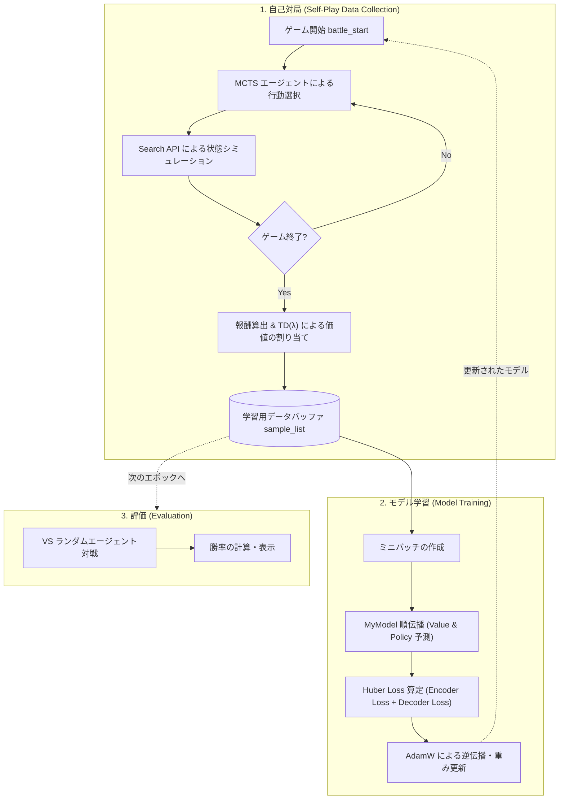

# Reinforcement Learning & MCTS サンプルコード詳細解説

本ドキュメントでは、[reinforcement-learning-and-mcts-sample-code.ipynb](file:///mnt/d/work/git/kaggle_PTCG_AI_Battle/samples/Reinforcement_Learning_and_MCTS_sample_code/reinforcement-learning-and-mcts-sample-code.ipynb) で実装されている強化学習（RL）およびモンテカルロ木検索（MCTS）を組み合わせたAIエージェントの仕組みとコード構造について詳細に解説します。

---

## 1. 概要 (Overview)

ポケモンカードゲーム（PTCG）は、カード効果の多様性・非完全情報性（山札や手札が非公開）・複雑な選択肢といった特徴を持つ非常に広大な状態空間を持つゲームです。

本サンプルコードは、**AlphaZeroスタイルの「Transformerベースのニューラルネットワーク + MCTS (モンテカルロ木検索)」** を用いて、自己対局（Self-Play）により自律的に強くなるAIエージェントを構築・学習させるパイプラインを提供しています。また、公式の **Search API (`search_begin`, `search_step`, `search_end`)** および **Battle API (`battle_start`, `battle_select`, `battle_finish`)** の標準的な使用例となっています。

> [!NOTE]
> **本コードの主な特徴**
> 1. **Sparse Vector × EmbeddingBag**: 巨大かつ疎なカード情報・ゲーム状態を計算効率良くベクトル化
> 2. **Encoder-Decoder Transformer Architecture**: 盤面状態から「価値（Value）」を、行動選択肢から「方策（Policy）」を同時予測
> 3. **Search API 連携 MCTS**: 公式シミュレータ API を呼び出しながら木探索を実行
> 4. **Self-Play & TD($\lambda$) 学習**: 自己対局で生成されたデータに時間割引付き報酬を付与してネットワークを更新

---

## 2. 全体処理フロー (Pipeline Overview)

全体の学習ループは大きく分けて **評価 (Evaluation)** → **データ収集 (Self-Play)** → **モデル更新 (Training)** の3段階で構成されています。



---

## 3. 使用サンプルデッキの構成 (`sample_deck`)

本サンプルコード内で定義・使用されている `sample_deck`（全60枚）は、**メガユキノオーex** と **カイオーガ** を主力アタッカーに据えた水タイプ中心のデッキレシピとなっています。

| 分類 | カード名 (Card Name) | Card ID | 枚数 | 役割・特徴 |
|---|---|---|---|---|
| **ポケモン** | **Kyogre** (カイオーガ) | `721` | 2枚 | 水タイプのたねポケモン・副アタッカー |
| | **Snover** (ユキカブリ) | `722` | 4枚 | たねポケモン（メガユキノオーexの進化元） |
| | **Mega Abomasnow ex** (メガユキノオーex) | `723` | 4枚 | メイン大型アタッカー（メガシンカポケモンex） |
| **トレーナーズ** | **Secret Box** (シークレットボックス) | `1092` | 1枚 | **ACE SPEC**（手札を捨てて山札から各種カードを捜索） |
| | **Ultra Ball** (ハイパーボール) | `1121` | 2枚 | 手札2枚トラッシュでポケモン全般を捜索 |
| | **Mega Signal** (メガシグナル) | `1145` | 2枚 | メガシンカポケモン捜索・進化サポート用グッズ |
| | **Powerglass** (パワーグラス) | `1163` | 2枚 | ポケモンのどうぐ（トラッシュからの基本エネルギー加速） |
| | **Team Rocket's Petrel** (ロケット団のラムダ) | `1219` | 4枚 | サポート（ドロー・山札操作） |
| | **Lillie's Determination** (リーリエの決意) | `1227` | 4枚 | メインドローサポート |
| | **Surfing Beach** (なみのりビーチ) | `1262` | 2枚 | 水ポケモンをサポートするフィールドスタジアム |
| **エネルギー** | **Basic {W} Energy** (基本水エネルギー) | `3` | 33枚 | 大量の基本水エネルギー |
| **合計** | | | **60枚** | **全60枚で構築** |

> [!NOTE]
> **デッキの特徴**
> 基本水エネルギーが33枚と非常に高い比率で投入されています。これは、強化学習・MCTSの自己対局において「エネ事故（エネルギーが引けず技が使えない状態）」を防ぎ、AIが効果的に攻撃行動や状態遷移を学習できるように配慮されたサンプル用レシピです。

---

## 4. データ表現とスパース処理 (`SparseVector`)

PTCGの盤面には、多数のカードID、HP、ステータス、エネルギー装着状況など多様な数値データが存在します。これらを密なテンソル（Dense Tensor）として保持すると次元数が爆発するため、本実装では **スパースベクトル表現 (`SparseVector`)** と **`torch.nn.EmbeddingBag`** を組み合わせています。

### `SparseVector` の仕組み
* `index`: 非ゼロ要素のインデックス
* `value`: 非ゼロ要素の値（規格化された数値）
* `offset`: 各単語/トークンの開始インデックス

### 特徴量エンコーディング
* **Encoder（盤面状態 $s$）**:
  * 自他プレイヤーのベンチ/アクティブポケモン（HP, カードID, 道具, エネルギー）
  * 手札、山札、トラッシュ、サイド枚数、特殊状態（毒・火傷・睡眠など）
  * スタジアム、経過ターン数、先攻/後攻フラグ
* **Decoder（選択肢/行動 $a$）**:
  * 選択可能なオプション（パス, Yes/No, 技使用, カード使用, エネルギー装着, 進化, 退却など）

---

## 5. ニューラルネットワーク構造 (`MyModel`)

本サンプルコードでは、盤面評価と行動評価を行うために **Transformer** を組み合わせたカスタムモデル `MyModel` を採用しています。

```
                       [ 盤面状態 s (Encoder Input) ]
                                    │
                         EmbeddingBag (sum)
                                    │
                          TransformerEncoder
                                    │
                   ┌────────────────┴────────────────┐
                   ▼                                 ▼
             Encoder FC                        Decoder Layer
                   │                      (Cross-Attention with s)
                   ▼                                 │
          価値 Value V(s)                            ▼
             [-1, 1]                            Decoder FC
                                                     │
                                                     ▼
                                            方策 Policy P(a|s)
                                                 [-1, 1]
```

### コンポーネントの詳細

1. **Encoder**:
   * 入力: 盤面状態ベクトル `sv_enc`
   * `EmbeddingBag` により固定長の分散表現へ埋め込み
   * `TransformerEncoderLayer` を介して、盤面全体の文脈（相互関係）を抽出
   * 最終レイヤー (`encoder_fc` + `tanh`) により、現在の盤面における**勝ちやすさ（価値 $V(s) \in [-1, 1]$）** を出力
2. **DecoderLayer & Decoder**:
   * 入力: 各行動選択肢のベクトル `sv_dec` および Encoder の出力 `encoder_out`
   * **Cross Attention (`torch.nn.MultiheadAttention`)** を用いて、「現在の盤面文脈 `encoder_out` の下で、各行動 `sv_dec` がどれほど適切か」をアテンション計算
   * 各行動の**選ばれやすさ/優先度（方策スコア $P(a|s)$）** を出力

---

## 6. MCTS (モンテカルロ木検索) と Search API

`mcts_agent` 関数では、公式の Search API と連携して思考時間を模したMCTS探索を行います。

### 1. 情報補完 (Determinization)
相手の手札や山札・サイドの内容は非公開（手札枚数や枚数のみ判明）であるため、`search_begin` 呼び出し時に未知カードをダミー/ランダムなカード（例: ヤドラン/基本エネルギー等）で埋めてシミュレーション用の決定論的ゲーム状態を作ります。

### 2. PUCT アルゴリズムによる選択
各ノードにおいて、以下のスコア $v$ が最大となる子ノードを選択します：
$$v = \bar{Q} + c \cdot P(a) \cdot \frac{\sqrt{N_{\text{parent}}}}{1 + N_{\text{child}}}$$
* $\bar{Q}$: 子ノードの平均価値（相手手番の場合は反転）
* $P(a)$: ニューラルネットワークの Decoder が出力した事前確率（Softmax正規化済み）
* $N$: 訪問回数

### 3. 木の拡張とシミュレーション (`search_step`)
未訪問のノードに到達した場合、`search_step` を呼び出してゲームシミュレータを進め、新しい盤面状態で `MyModel` による評価値 $V(s)$ と選択肢スコア $P(a|s)$ を計算して親ノードへバックプロパゲーション（逆伝播）します。

---

## 7. 自己対局データ収集 と TD($\lambda$) 報酬計算

1エピソード（1対局）終了後、各局面での推測値と最終勝敗（勝利: `+1.0`, 敗北: `-1.0`）を組み合わせ、時間割引パラメータ $\lambda = 0.9$ を使ったバックワード計算（TD法的な平滑化）で学習ラベル `sample.value` を更新します。

$$ \text{label}_t = \frac{\text{value}_{t+1} + \text{sample.value}_t}{2} $$
$$ \text{value}_t = \text{value}_{t+1} \cdot \lambda + \text{sample.value}_t \cdot (1 - \lambda) $$

これにより、単なる最終勝敗だけでなく、MCTS検索で得られた中間局面の評価値も考慮された高品質な価値ラベルが生成されます。

---

## 8. モデル学習 (Model Training)

集められた `LearnSample` のバッチを用いて、以下の損失関数により `MyModel` をエンドツーエンドで更新します。

$$\text{Loss}_{\text{total}} = \text{Loss}_{\text{encoder}}(V(s), y_V) + \text{Loss}_{\text{decoder}}(P(a|s), y_P)$$

* **Encoder Loss**: 予測価値 $V(s)$ と 算出ラベル $y_V$ の **Huber Loss** ($\delta=0.2$)
* **Decoder Loss**: 予測方策 $P(a|s)$ と MCTS訪問頻度から求めたターゲット確率分布 $y_P$ の **Huber Loss** ($\delta=0.1$) （無効なアクションにはマスク処理を適用）
* **Optimizer**: `AdamW` (学習率 `3e-4`)

---

## 9. コンペ勝ち上がり・改善に向けたポイント

このサンプルコードをベースに、さらに強いAIを構築するための拡張アイデア：

> [!TIP]
> 1. **MCTS探索回数の増加 (`SEARCH_COUNT`)**:
>    * 現在は高速化のため `SEARCH_COUNT = 10` と小さく設定されていますが、これを 50〜200 に増やすことで劇的に探索精度が向上します。
> 2. **特徴量（State & Option）の強化**:
>    * 現在の SparseVector は簡易的なエンコーディングです。各カードのタイプ、技の威力、弱点・抵抗力、特殊効果のタグ付けなどを特徴量に組み込むことが有効です。
> 3. **ネットワーク構造の深化**:
>    * `MyModel(128, 2, 256, 1, 1)` のレイヤー数（Encoder/Decoder）や埋め込み次元数を拡張（例: d_model=256, nhead=4, layers=3など）。
> 4. **Opponent Determinization の精度向上**:
>    * 相手の山札・手札のダミー推測を、トラッシュされたカードやデッキレシピから推測する「相手デッキ推定ロジック」を組み込む。
